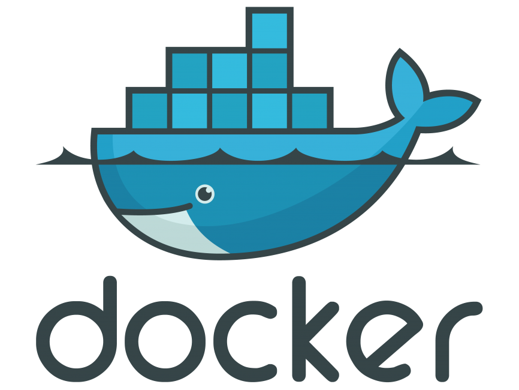
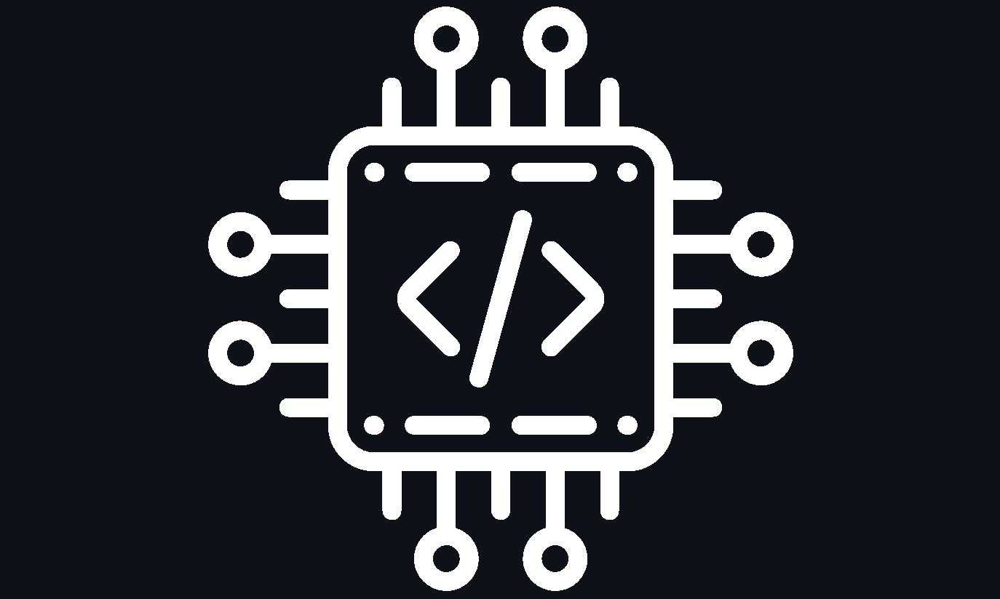
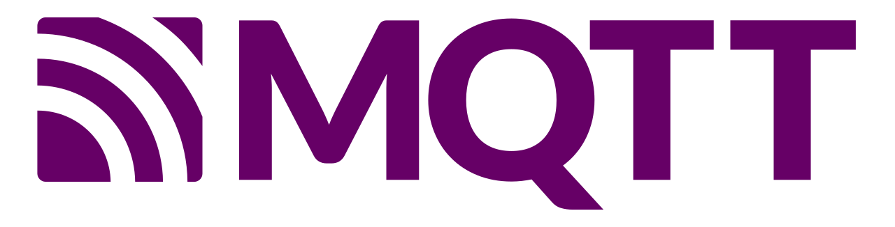

<h1 align="center">
  
</h1>

<h5 align="center">
  <code>
    <a href="https://www.linkedin.com/in/mohamed-saeed-6aa73aa7/" title="LinkedIn Profile"> LinkedIn</a></code>
</h5>
 

  Hi, I'm Moahmed Saeed, Teaching Assistant & Computer Engineer & Software Developer from Egypt
   
   
  🎓 I graduated from Arab Academy for Science, Technology University Computer Engineering Department 🎓
   
  🎓 I graduated from El Nasr English School 🎓
   
  🖥️ I love writing code and learn anythings about it 🖥️ 
  &nbsp;&nbsp;&nbsp;&nbsp;&nbsp;⌨️🖱️&nbsp;&nbsp;&nbsp;&nbsp;&nbsp;&nbsp;&nbsp;&nbsp;&nbsp;&nbsp;&nbsp;&nbsp;&nbsp;&nbsp;&nbsp;&nbsp;&nbsp;&nbsp;&nbsp;&nbsp;&nbsp;&nbsp;&nbsp;&nbsp;&nbsp;&nbsp;&nbsp;&nbsp;&nbsp;&nbsp;&nbsp;&nbsp;&nbsp;&nbsp;&nbsp;&nbsp;&nbsp;&nbsp;&nbsp;&nbsp;&nbsp;&nbsp;&nbsp;&nbsp;&nbsp;&nbsp;&nbsp;&nbsp;&nbsp;&nbsp;&nbsp;&nbsp;&nbsp;&nbsp;&nbsp;&nbsp;&nbsp;&nbsp;&nbsp;&nbsp;&nbsp;&nbsp;&nbsp;&nbsp;&nbsp;&nbsp;&nbsp;&nbsp;&nbsp;&nbsp;&nbsp;&nbsp;&nbsp;&nbsp;⌨️🖱️&nbsp;&nbsp;&nbsp;&nbsp;
   
  📫 How to reach me: <a href="mailto: mohamedsaed8@live.com">mohamedsaed8@live.com</a> 📫

<h2 align="center">🔥 Languages & Frameworks & Tools & Abilities 🔥</h2>
 

  <code></code>
  <code></code>
  <code></code>
  <code></code>
  <code></code>
  <code></code>
  <code></code>
  <code></code>
  <code></code>
  <code></code>
  <code></code>
  <code></code>
  <code></code>
  <code></code>
  <code></code>
  <code></code>
  <code></code>
  <code></code>
  <code></code>
  <code></code>
  <code></code>
  <code></code>
  <code></code>
  <code></code>

<h2 align="center">⚡ Stats ⚡</h2>
 

  

    
    
  

          
  

    
  

   
    
  

<h2 align="center">👨‍💻 Repositories 👨‍💻</h2>
 

  

      

  
  

      
<h4 align="center">
  <a href="https://github.com/chebSa3id?tab=repositories" title="Show Repositories">🔎 Show More 🔍</a>
</h4>

<!--
**chebSa3id/chebSa3id** is a ✨ _special_ ✨ repository because its `README.md` (this file) appears on your GitHub profile.

Here are some ideas to get you started:

- 🔭 I’m currently working on ...
- 🌱 I’m currently learning ...
- 👯 I’m looking to collaborate on ...
- 🤔 I’m looking for help with ...
- 💬 Ask me about ...
- 📫 How to reach me: ...
- 😄 Pronouns: ...
- ⚡ Fun fact: ...

Notes: If you want use this readme, firstly star it please. If you can't align your repositories like this, please change your repository desription to shorter than now. Maybe 4 or 5 word will be good.

-->
